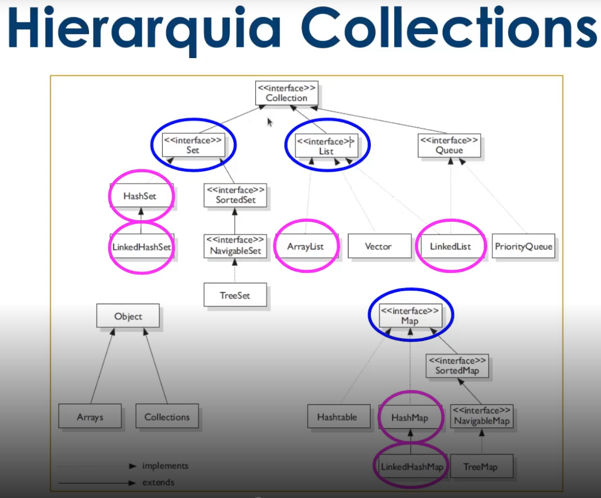

# Collections

### Collections framework

Objeto que agrupa múltiplos elementos que podem 
ser variáveis primitivas ou objetos dentro de 
uma única unidade.

Serve para armazenar e processar conjuntos de
dados de forma eficiente.

Veio no Java 2.

### Composição

- **Inferfaces** -> É um contrato que quando assumido 
por uma classe deve ser implementado
- **Implementações ou classes** -> São materializações,
a codificação das interfaces
- **Altoritimos** -> Sequência lógica, finita e definida de instruções que devem ser seguidas para resolver um problema.

# Listas

Pacote: java.util.List

- Permite elementos duplicados e garante ordem de inserção
  - ArrayList -> Usa um array dinâmico para armazenar elementos
  - Com a vinda dos genéricos, esta classe suporte o armazenamento de todos os tipos de objeto. Mais rápida do que LinkedList para pesquisas.
  - LinkedList -> Usa uma estrutura de lista duplamente ligada para armazenar elementos. Mais rápido para remoção de elemtnos do que ArrayList
