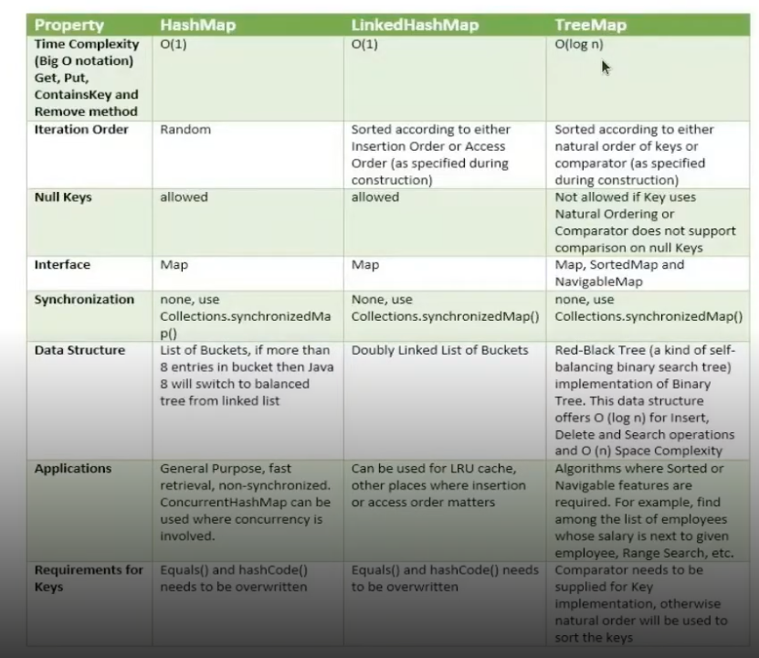

# Map

## Coleções de pares: Map Collections

pacote: java.util.Map

** ***Não extende da interface collection*** **

- **HashMap**
- **LinkedHashMap**
- **TreeMap**

## Map

- Elementos únicos (key) para cada valor (value)
  - HashTable - um pouco antigo
  - TreeMap - Extende Navigable
  - HashMap - Extende de Map
  - LinkedHashMap - Extende de HashMap

Map.Entry<K, V> é uma interface interna da interface Map em Java. Ela representa um par chave-valor dentro de um Map.

📌 Em outras palavras:
Quando você chama map.entrySet(), você obtém um conjunto (Set) de objetos que implementam Map.Entry<K, V>, e cada um deles representa um único par (chave, valor) do mapa.

💡 Por que usar Map.Entry?
Permite acessar tanto a chave quanto o valor em uma única iteração.
É útil para modificar valores diretamente dentro do Map.
Facilita filtros e remoções baseadas em chave e valor ao mesmo tempo.