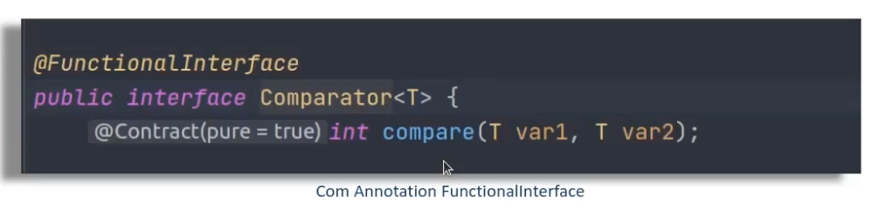
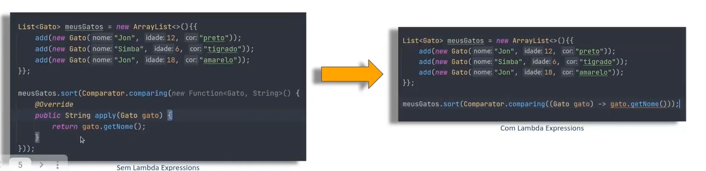
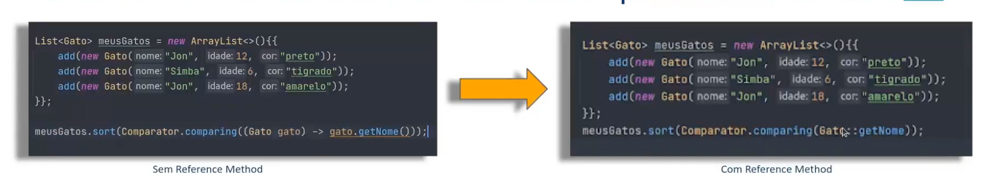

# Stream API Java

## 1) Classe anônima

    É uma classe que não recebe nome e é declarado e 
    instânciado em uma única instrução.
    Deve-se considerar o uso desse tipo de classe
    sempre que você precisa usar essa classe
    uma única vez

## 2) Funcional Interface

    Qualquer interface com um SAM (Single abstract
    Method) é uma interface funcional e sua 
    implementação pode ser tratada como expressões
    lambda

## Interfaces funcionais que veremos
- Comparator
- Consumer
- Function
- Predicate

## 3) Lambda

Uma função lambda, é uma função sem declaração, isto é,
não é necessário colocar um nome, um tipo de retorno
e o modificador de acesso. A idéia é que o método
seja declarado no mesmo lugar em que será usado.
As funções lambda em java tem a sintaxe definida como
(argumento) -> (corpo)

## 4) Reference Method

    Recurso que veio a partir do Java 8 que permite
    fazer referência a um método ou construtor
    de uma classe (de forma funcional) e assim
    indicar que ele deve ser utilizado num ponto
    especifico do código, deixando-o mais simples
    e legível. Para utilizá-lo, basta informar
    uma classe ou referência seguida do símbolo
    :: e o nome do método sem parenteses no final.
    
    Referente method serve para simplificar uma
    expressão lambda

## 5) Stream API

    Stream API traz uma nova opção para manipulação 
    de coleções em Java seguindo os princípios
    da programação funcional. Combinada com
    expressões lambda, ela proporciona uma forma
    diferente de lidar com conjuntos de elementos,
    oferecendo ao desenvolvedor uma maneira simples
    e concisa de escrever código que resulta em 
    facilidade de manutenção e paralização sem
    efeitos indesejados em tempo de execução

***Pipeline*** -> Operação intermediária